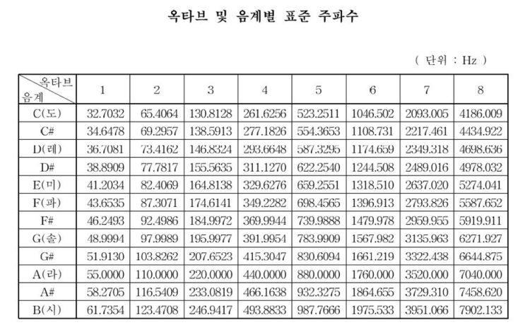

# buzzer
	- 원하는 주파수 값을 인가하여 소리를 내는 소자
	- 극성이 존재하므로 연결시 주의 필요
	- 3.3V ~ 5V 에서 작동

## 참고자료

## 필요 하드웨어
	- buzzer
	- Arduino UNO
	- UNO cable
	- breadboard
	- M-M cable(2ea)

## 연결
	- D7단자 대신 다른 디지털 핀에 연결해도 무방
|buzzer|Audino UNO|
|--|--|
|+단자|D7(변경 가능)|
|-단자|GND|

## example_code1.cpp (음계 소리 테스트)
## example_code2.cpp (간단한 멜로디)